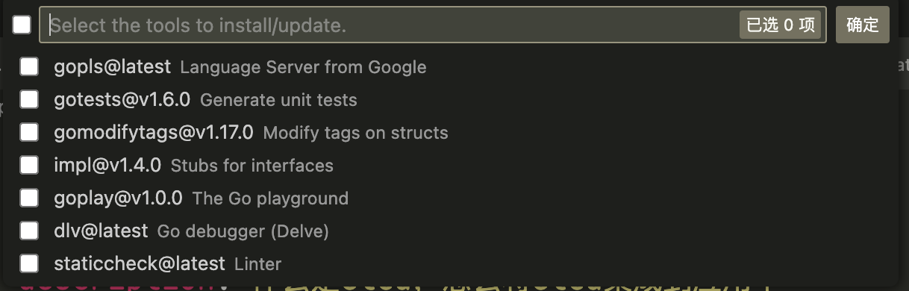
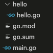

推荐基础语法学习书籍：[Go入门指南](https://github.com/unknwon/the-way-to-go_ZH_CN)

基础语法的完整学习请参照上述书籍，本文档仅针对可能出错的点，或者需要注意的点进行说明。

## 安装

安装完成后，命令行输入
``` bash
go version
```
如果有版本号输出，说明安装成功，如果显示not found字样，可能是由于未添加到$PATH导致的，自行寻找一下添加到path的方法

### linux添加path

在~/.bashrc添加`export PATH=$PATH:go路径`（针对bash，其他终端可能有不同的配置文件）

### 设置代理

> 注意，安装成功后，代理一定要进行设置，代理用于国内go mod直接访问代码仓库

``` bash
go env -w GOPROXY=https://goproxy.cn,direct
```

## IDE

适合go语言开发的ide推荐两个，一个是vscode安装golang插件，另一个是goland（收费），前者相对轻量级，后者功能更全

### vscode

Go插件安装后会提醒你安装相关工具，如果不设置代理该步就会失败，可以通过命令面板：Go: install/update tools去重新安装工具



## 错误处理

值得一提的是go独特的错误处理机制，在每个函数后几乎都会有错误值的返回，也就是error类型，对于错误的处理应该做到每个错误都进行，而不是为了图省事用_替代

### panic && recover

panic是一个很独特的机制，它将直接使程序崩溃，panic一般用于不可恢复的错误场景，但在服务器开发时，为了保障服务器持续运行，应当在发生panic的情况下仍然保持运行，这个时候需要用到recover方法去做从崩溃中恢复。

各个服务器框架基本都有自己的recover中间件，大家可以通过阅读这些中间件的源码深入了解recover机制的工作原理
- [Fiber recover 中间件](https://github.com/gofiber/fiber/tree/main/middleware/recover)
- [Gin recovery中间件](https://github.com/gin-gonic/gin/blob/master/recovery.go#L33)

## Package

本学期第二次例会我们也说了，需要对项目进行拆分，不能把所有源码写在一个文件夹里，为此，go提供了一个package的功能，也就是包

通常来说，一个文件夹可以作为一个包

主程序，也就是main函数所在的文件夹通常有go.mod文件，go.mod所在的文件夹为该项目的根目录，go.mod由`go mod init (项目名)`来生成，当我拆分功能时，新建的文件夹不需要新建go mod，包里的package由package main（主程序独占），变为了package 包名，通过import对包进行导入。比如说我现在项目结构如下：


项目名字是test，hello.go的内容如下
``` go
package hello

import "fmt"

func Hello() {
	fmt.Println("你好")
}

```

也就是说，在hello包里定义了一个Hello函数，那么我们如果想在main里调用他，需要首先import包的地址，自定义包的地址为{{项目名}}/子路径，比如这里，hello包的地址就是test/hello

所以我们可以这样去调用hello函数

``` go
package main

import "test/hello"

func main() {
	hello.Hello()
}
```

在另一个包里调用这个函数也只需要import这个路径即可，调用方法就是包名+函数名。

在现代IDE中，通常打出包名，找到自动提示回车即可自动导包

注意，包名可以进行修改，比如我们遇到test/hello包和test/tool/hello包，可以令其中一个叫hello2，只需要这么import：
``` go
import hello2 "test/hello"
import "test/tool/hello"
```

### 特殊的包名要求

当我在github，或者其他git平台托管我的项目时，建议将项目名设成 github.com/dingdinglz/项目名的形式。
这样设有几点好处：
- 方便阅读代码的人定位到代码真实所在
- 第三方可以通过该地址调用你自定义包的函数，尽管他可能不是你项目的一部分

## 指针

go的指针相对来说比较特殊，尤其是在你学了c的指针的情况下，比如下面这段代码
``` go
func Test() *string {
	s := "你好"
	return &s
}
```
如果以c的思想去理解，这个函数显然不能正常工作，但是取决于go的GC机制，这段代码是可以正常工作的，s将会在指针不再被使用时被销毁，而不像c那样严格地离开生命周期后才会被销毁。

所以：在三方库或者自己功能结构体的开发过程中，下面的写法是极其常见的
``` go
func NewStruct() *Struct {
	return &Struct{
		
	}
}
```

## 持续更新...

当有同学踩到go的新坑时，该篇文档可能就会继续更新...

总之：欢迎提问😊

[回到主页](./readme.md)