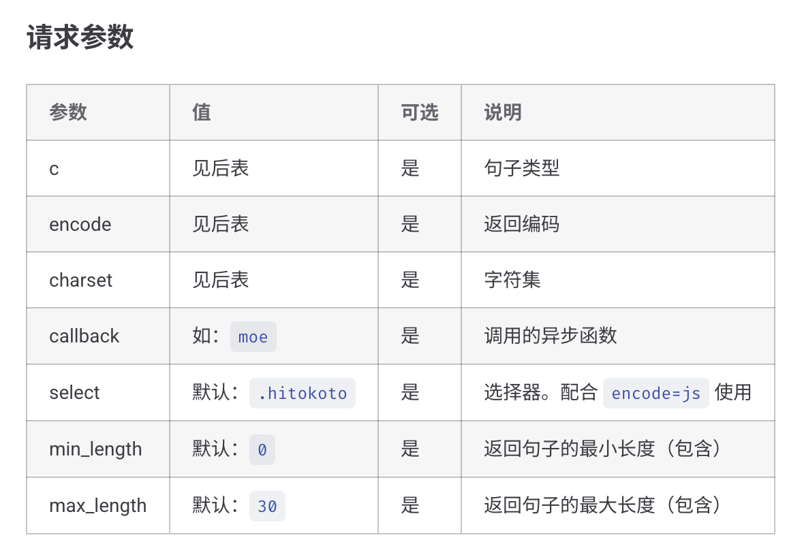
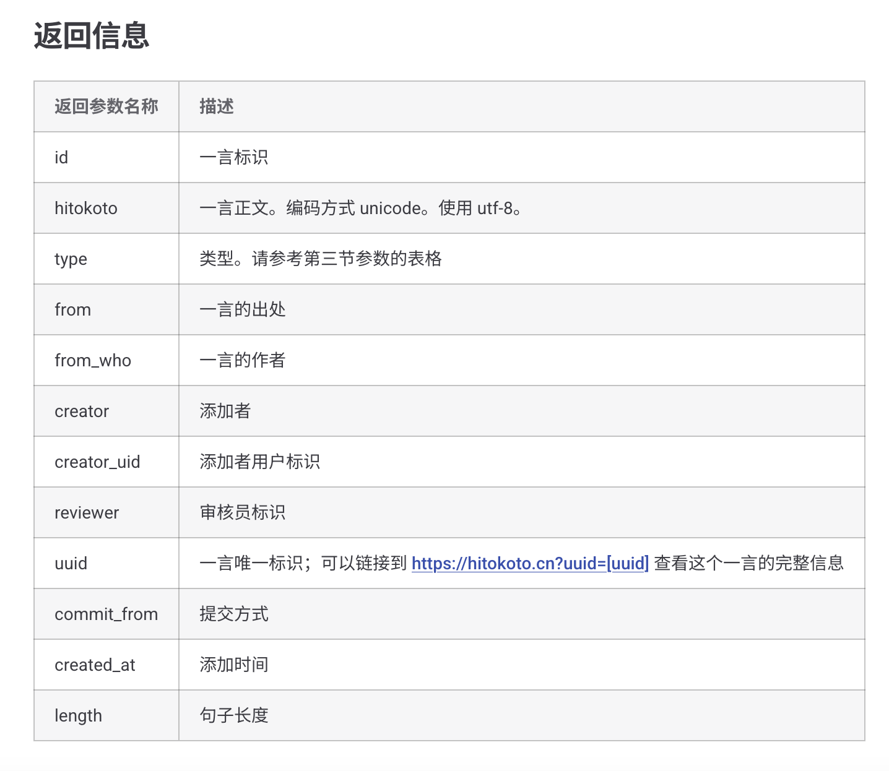

## 什么是api

[什么是API](https://zh.wikipedia.org/wiki/%E5%BA%94%E7%94%A8%E7%A8%8B%E5%BA%8F%E6%8E%A5%E5%8F%A3)（来自维基百科）

然而今天我们要谈论的并不是这种广义上的api，而是web api，这种一般是服务提供商方便我们使用三方服务提供的接口，一般通过http去调用，也有类似提供websocket或者sse的接口（参见这次vivo aigc提供的接口）

首先，我们以一个简单的接口举例：[一言接口文档](https://developer.hitokoto.cn/sentence/)

这个接口之前例会拿cpp调用演示了一次，这次我们用go来调用，并研究更深层次的用法。

首先拿到一个接口文档，我们要关注一下内容：

1. 调用方式（GET还是POST还是其他？）
2. api地址，比如本接口中的：`v1.hitokoto.cn`
3. 请求参数：


4. 返回参数：

传入参数的方式，GET一般是query，也就是?name=&pass=这样的格式，POST一般是form。

对应到gin的解析方式，一个是`ctx.Query()`，一个是`ctx.PostForm()`

当然，有的时候POST也可以要求用query传数据。

至于返回数据，目前最主流的方式就是JSON，之前例会我们也介绍过了。

## 调用一言接口

首先它是一个GET接口，让我们先不带任何参数，请求一下，看看返回的格式是如何的。

```go
package main

import (
	"fmt"
	"io"
	"net/http"
)

func main() {
	res, e := http.Get("https://v1.hitokoto.cn/")
	if e != nil {
		panic(e)
	}
	if res.StatusCode != http.StatusOK {
		panic("请求失败！")
	}
	defer res.Body.Close() // 保证在程序结束关闭连接
	body, e := io.ReadAll(res.Body)
	if e != nil {
		panic(e)
	}
	bodyText := string(body)
	fmt.Println(bodyText)
}
```

可以看到，返回的格式如下：

```json
{
    "id": 479,
    "uuid": "05f790b7-527b-4aa3-9112-365e061cfa25",
    "hitokoto": "透过孩子的眼神，让我相信这个世界上还有着纯真。",
    "type": "g",
    "from": "宫崎骏",
    "from_who": null,
    "creator": "anythink",
    "creator_uid": 0,
    "reviewer": 0,
    "commit_from": "web",
    "created_at": "1468950861",
    "length": 23
}
```

要取回数据，只需要解析返回的json就可以了。

### Go解析json的方法

golang提供了`encoding/json`包实现序列化和反序列化json，想要反序列化json，（即把json变成我们可以操作的对象）我们通常是把一个json绑定到一个对应的结构体，比如：

```json
{
	"name": "dinglz",
	"age": 18
}
```

可以解析到如下结构体

```go
type Person struct {
	Name string `json:"name"`
	Age int `json:"age"`
}
```

这里，由于结构体不允许公开参数首字母是小写，所以我们需要用一个json tag去把json的字段对应到结构体的字段，然后可以用`json.Unmarshal`去把json的数据解析到struct上

```go
data := Person{}
json.Unmarshal([]byte(jsonText) , &data)
```

除了解析到结构体，也可以解析到`map[string]interface{}`，之前说过，`interface{}`也就是`any`，可以灵活的转换成任意结构，这也是go在设计中对泛型的妥协（虽然现在已经支持了泛型的写法，interface{}仍然是很通用的写法）

---

那么我们这里先用结构体的方法对结果进行解析，这里给大家一个网站，可以根据一个json的格式生成对应的go struct：[点我使用](https://www.bejson.com/transfor/json2go/)

> [!NOTE]
> 不需要工具我们当然也可以手写出用来存储数据的结构体，但是开发效率和代码质量是衡量一个优秀的程序员的标准，当我们巧妙的使用工具，提升自己的开发效率，才是正确的选择。
> AI同理，我们当然可以合理的利用它，但当你不知道它在干什么时，最好不用使用它，因为我们应该是让AI帮我们写已经会的内容，或者启发我们的思路，而不是看不懂AI的代码就直接用，这样无法让你的编码能力得到任何的提升。

那么对应的结构体如下：

```go
type Data struct {
	ID int `json:"id"`
	UUID string `json:"uuid"`
	Hitokoto string `json:"hitokoto"`
	Type string `json:"type"`
	From string `json:"from"`
	FromWho interface{} `json:"from_who"`
	Creator string `json:"creator"`
	CreatorUID int `json:"creator_uid"`
	Reviewer int `json:"reviewer"`
	CommitFrom string `json:"commit_from"`
	CreatedAt string `json:"created_at"`
	Length int `json:"length"`
}
```

那么我们解析一下，并把一言的内容输出出来：

```go
package main

import (
	"encoding/json"
	"fmt"
	"io"
	"net/http"
)

type Data struct {
	ID         int         `json:"id"`
	UUID       string      `json:"uuid"`
	Hitokoto   string      `json:"hitokoto"`
	Type       string      `json:"type"`
	From       string      `json:"from"`
	FromWho    interface{} `json:"from_who"`
	Creator    string      `json:"creator"`
	CreatorUID int         `json:"creator_uid"`
	Reviewer   int         `json:"reviewer"`
	CommitFrom string      `json:"commit_from"`
	CreatedAt  string      `json:"created_at"`
	Length     int         `json:"length"`
}

func main() {
	res, e := http.Get("https://v1.hitokoto.cn/")
	if e != nil {
		panic(e)
	}
	if res.StatusCode != http.StatusOK {
		panic("请求失败！")
	}
	defer res.Body.Close() // 保证在程序结束关闭连接
	body, e := io.ReadAll(res.Body)
	if e != nil {
		panic(e)
	}
	data := Data{}
	e = json.Unmarshal(body, &data)
	if e != nil {
		panic(e)
	}
	fmt.Println(data.Hitokoto)
}
```

这下运行程序就能直接输出一句话了，如果我们想要输出其他信息，比如作者等等，通过`Data.From`结构体的参数也能轻松取到。

之前的例会我们到此为止了，下面让我们继续探索一下请求参数：比如我们只想要诗词的内容，根据文档的描述，我们就需要指定c为i，那么让我们修改URL加上query：`?c=i`即可。（如果有多个query，可以用&链接，比如`?c=i&encode=json`）

> 需要注意，当query中含有汉字或者特殊字符时，需要进行url编码，有很多包支持类似的功能，不再赘述

加上类型指定后的代码：

```go
package main

import (
	"encoding/json"
	"fmt"
	"io"
	"net/http"
)

type Data struct {
	ID         int         `json:"id"`
	UUID       string      `json:"uuid"`
	Hitokoto   string      `json:"hitokoto"`
	Type       string      `json:"type"`
	From       string      `json:"from"`
	FromWho    interface{} `json:"from_who"`
	Creator    string      `json:"creator"`
	CreatorUID int         `json:"creator_uid"`
	Reviewer   int         `json:"reviewer"`
	CommitFrom string      `json:"commit_from"`
	CreatedAt  string      `json:"created_at"`
	Length     int         `json:"length"`
}

func main() {
	res, e := http.Get("https://v1.hitokoto.cn/?c=i")
	if e != nil {
		panic(e)
	}
	if res.StatusCode != http.StatusOK {
		panic("请求失败！")
	}
	defer res.Body.Close() // 保证在程序结束关闭连接
	body, e := io.ReadAll(res.Body)
	if e != nil {
		panic(e)
	}
	data := Data{}
	e = json.Unmarshal(body, &data)
	if e != nil {
		panic(e)
	}
	fmt.Println(data.Hitokoto)
}
```

这下取出的内容只有诗词了。

当然，不同的api有不同的文档，上面只是展示了一言api的使用方法，调用其他的api请以文档为准。

## http client包

我们刚刚用的是官方的http请求包，功能可能较少，给大家推荐一个非常好用的client包，功能很多：[Resty](https://resty.dev/)

## AI LLM 接口

接下来的项目中我们需要调用ai服务商的api，这些涉及到sse等可能比较复杂，我们在项目中会使用我封装好的包：[OpenAI](https://github.com/dingdinglz/openai)，这个包最初是为了方便软创项目中对AI的调用封装而成，最后被我剥离出了做成了个三方包。

readme写的相对来说比较详细，想了解用法可以直接看readme

---

[回到主页](README.md)